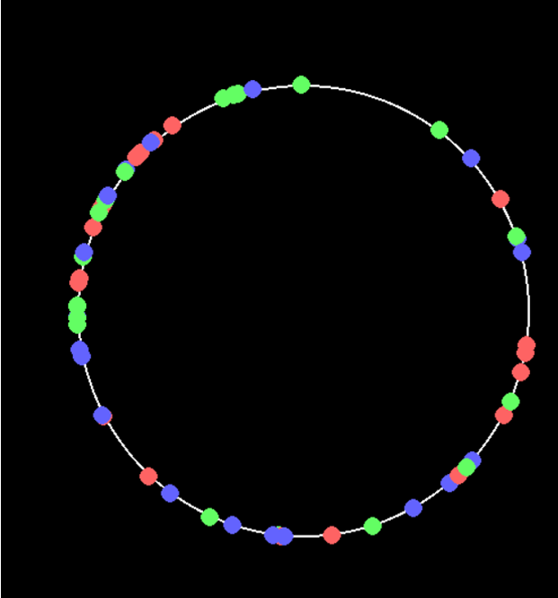
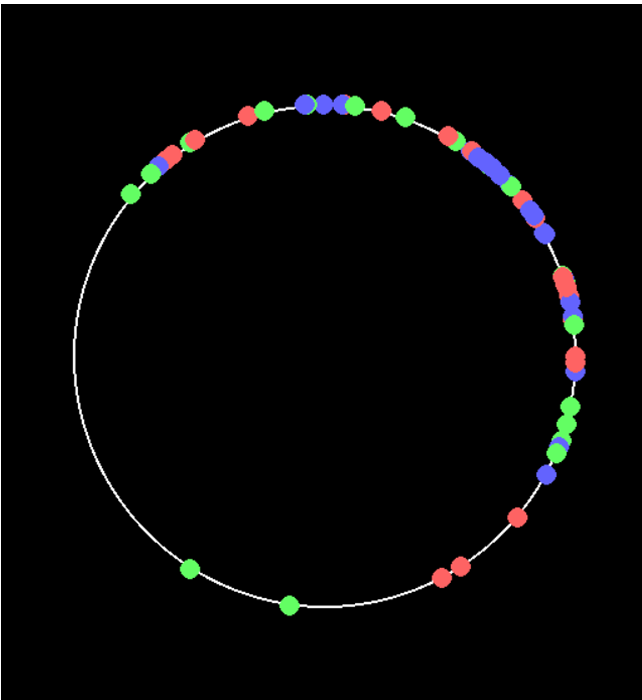
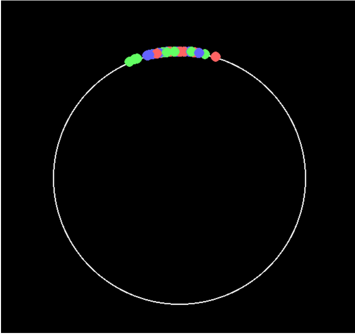
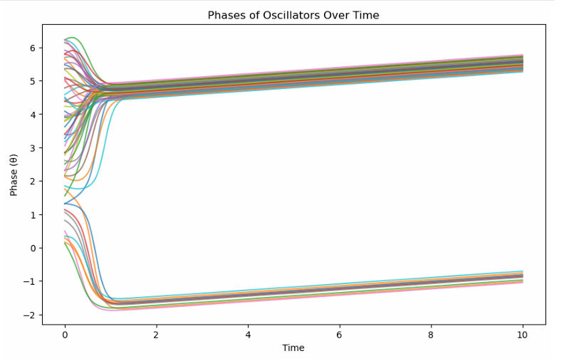
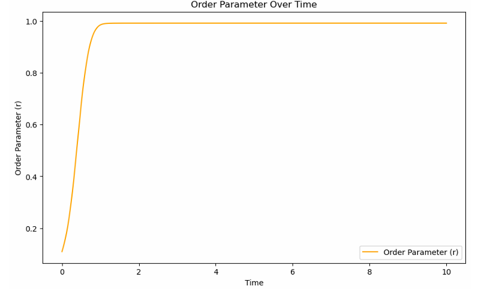
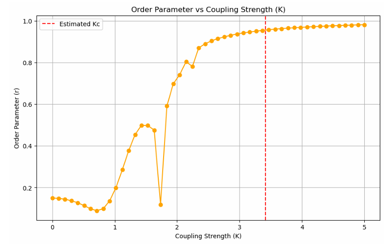

# Kuramoto Model of Synchronization Simulation

This project provides a simulation and visualization of the **Kuramoto model**, a mathematical model used to describe synchronization in a large set of coupled oscillators. The simulation is built using `Pygame` for real-time visualization, and the analysis is performed using `SciPy`, `NumPy`, and `Matplotlib`.

The model describes the behavior of a population of `N` coupled oscillators, each with its own intrinsic natural frequency ωᵢ and a phase θᵢ. The evolution of each oscillator's phase is determined by its interaction with all other oscillators in the system, governed by a coupling strength `K`.


## 📜 Table of Contents
* [Introduction](#-introduction)
* [Features](#-features)
* [Visualization](#-visualization)
* [Installation & Setup](#-installation--setup)
* [Usage](#-usage)
* [Analysis of Results](#-analysis-of-results)
* [Requirements](#-requirements)
* [License](#-license)

## ✨ Features
- **Real-time Visualization**: An interactive `Pygame` window displays the oscillators as points on a circle, showing their phases evolve over time.
- **Phase Dynamics Plot**: Generates a plot of the phase of each individual oscillator over time, clearly showing the transition towards synchronization.
- **Order Parameter Analysis**: Calculates and plots the Kuramoto order parameter, `r(t)`, which quantifies the macroscopic level of coherence in the system.
- **Coupling Strength Analysis**: Investigates the relationship between the coupling strength `K` and the final order parameter `r`, demonstrating the phase transition at the critical coupling value `Kc`.

## 📊 Visualization

The simulation provides several key visualizations to understand the synchronization dynamics.

### Real-time Pygame Simulation

The Pygame window shows the `N` oscillators distributed on a unit circle.
1.  **Initial State (Incoherent)**: Oscillators are scattered with random phases.
    
2.  **Transition State (Partial Synchronization)**: Oscillators begin to cluster together as the simulation progresses.
    
3.  **Final State (Synchronized)**: The majority of oscillators lock phases and move together.
    

### Analytical Plots

After the simulation, the notebook generates the following plots for analysis:

1.  **Phases of Oscillators vs. Time**: This plot shows how the phase of each oscillator converges. In this example, you can see partial synchronization, where oscillators form distinct phase-locked clusters.
    

2.  **Order Parameter vs. Time**: The order parameter `r` measures the overall coherence. `r = 0` indicates complete incoherence, while `r = 1` indicates full synchronization. The plot shows `r` increasing over time and stabilizing at a value less than 1, confirming partial synchronization.
    

3.  **Order Parameter vs. Coupling Strength (K)**: This plot illustrates the critical phase transition. The system remains incoherent (`r` ≈ 0) for low `K` values and abruptly synchronizes once `K` exceeds a critical value (`Kc`), which is estimated by the red dashed line.
    

## 🔧 Installation & Setup

To run this project locally, follow these steps:

1.  **Clone the repository:**
    ```bash
    git clone [https://github.com/adritacb/kuramoto-model-simulation.git](https://github.com/adritacb/kuramoto-model-simulation.git)
    cd kuramoto-model-simulation
    ```

2.  **Create a virtual environment (optional but recommended):**
    ```bash
    python -m venv venv
    source venv/bin/activate  # On Windows, use `venv\Scripts\activate`
    ```

3.  **Install the required packages:**
    ```bash
    pip install -r requirements.txt
    ```

## 🚀 Usage

The project is structured as a Jupyter Notebook (`Kuramoto Model of synchronization.ipynb`).

1.  **Launch Jupyter Notebook:**
    ```bash
    jupyter notebook
    ```

2.  **Run the Simulation**:
    - Open the notebook.
    - The first main code cell (labeled `[36]` in your notebook) runs the `Pygame` simulation. Executing this cell will open a new window showing the live animation of the oscillators.
    - **Important**: You must **close the Pygame window** to stop the simulation and allow the kernel to proceed.

3.  **Generate Plots**:
    - Once the simulation window is closed, you can run the subsequent cells in the notebook to generate the analytical plots for phase, order parameter, and the `r` vs. `K` analysis.

4.  **Customization**:
    - You can modify the model's parameters (e.g., `N`, `K`, `omega`) in the code cells to observe different synchronization behaviors.

## 🔬 Analysis of Results

The Kuramoto model exhibits fascinating collective behavior, which is captured in the plots:

- **Synchronization**: For a sufficiently high coupling strength (`K`), the oscillators overcome their natural frequency differences and lock into a common phase. This is visible in the phase plot where individual lines converge.
- **Partial Synchronization**: The provided plots show a state of partial synchronization. This occurs when the coupling strength `K` is high enough to form clusters of phase-locked oscillators, but not strong enough to merge all clusters into one. This is why the phase plot shows two distinct convergence points.
- **Order Parameter (`r`)**: The order parameter `r` quantifies this coherence. In the `r` vs. time plot, the value stabilizes below 1, which is characteristic of partial synchronization. If there were multiple clusters with different average phases, their vector sum on the complex plane results in a smaller magnitude, hence `r < 1`.
- **Phase Transition (`Kc`)**: The `r` vs. `K` plot clearly shows a phase transition. For `K < Kc`, the oscillators remain largely incoherent. As `K` approaches and surpasses the critical coupling `Kc`, the system undergoes a rapid transition to a synchronized state, indicated by the sharp increase in the final order parameter `r`.

